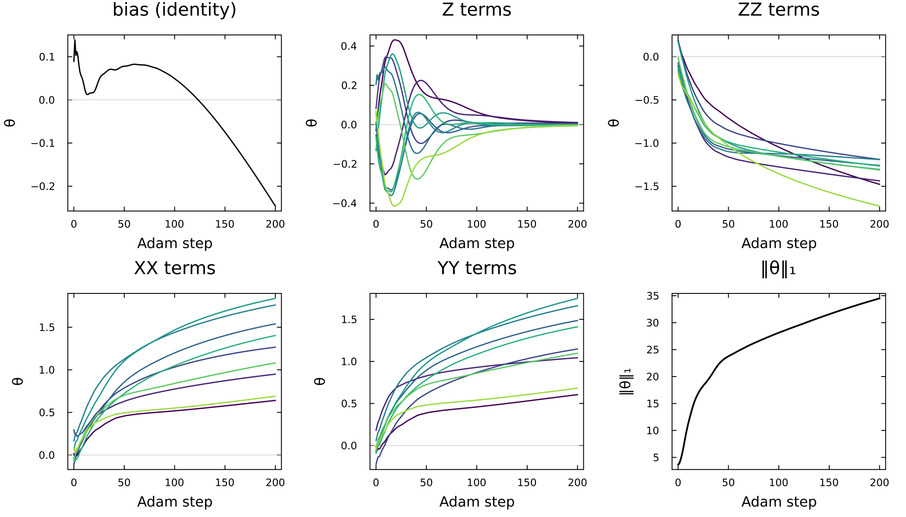
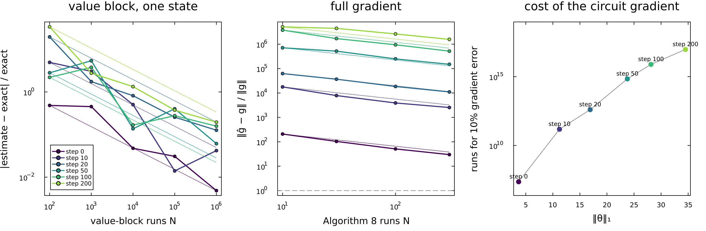

# 3_xx_xxx_grelu_minimal: a GReLU neuron trained with Algorithm 8

A single quantized GReLU neuron (He, Liu & Wilde, *Fermi–Dirac machines as quantizations of neurons*, arXiv:2605.24386) learns to tell thermal states of random 10-qubit XX spin chains from those of XXX chains. It is trained with **Algorithm 8** (squared loss). The pipeline records how the weights θ move during training and simulates the Algorithm 8 circuit shot by shot. This folder is the minimal version of the full study in `2_xx_xxx_grelu_study/`. That folder is not pushed yet; an earlier version is on the `xx-xxx-grelu-experiments` branch under `experiments/xx_xxx_grelu/`.

**Start with [pipeline.ipynb](pipeline.ipynb).** It holds all the code, cell by cell, with explanations and the results.

```
pipeline.ipynb  the whole pipeline with explanations (Julia 1.12 kernel)
neuron.jl       the neuron: GReLU, H(θ), the exact Alg 8 loss and gradient, firing (Alg 5),
                and the Alg 8 circuit simulated shot by shot
data.jl         load the 840 states, rebuild each one exactly, random train/test split
run.jl          data -> train -> circuit check -> test -> fire -> figures
plots.jl        the seven figures, redrawn from results/ (run.jl calls it)
figures/        PNGs from the latest run
results/        CSVs written by run.jl (not committed; re-run to regenerate)
archive/        the earlier version: Algorithms 8 and 9 compared, split by chain, with REPORT
```

The `.jl` files hold exactly the code cells of the notebook.

## Running

You need Julia 1.12 with HDF5, Optimisers, Plots and SpecialFunctions. The dataset must be at `../data/xx_xxx_thermal_states/xx_xxx_n10.h5`; it is not in git (2.9 GB). Either open the notebook with the "Julia 1.12" kernel, or run from the repository root:

```bash
julia 3_xx_xxx_grelu_minimal/run.jl      # ~12 min on an M1 Pro, ~2 GB memory
julia 3_xx_xxx_grelu_minimal/plots.jl    # redraw figures only, from results/
```

## Setup

- **Data:** 84 random chains (42 XX, 42 XXX), each at 10 temperatures kT = 0.1–2, giving 840 states. Every state is rebuilt exactly from its couplings.
- **Split:** random by state, stratified by class: 160 test states (80 per class) and 680 training states. Chains and temperatures are not kept together, so test states share chains with training states at other temperatures.
- **Neuron:** H(θ) = θ_I I + Σ θⱼ Hⱼ over Zᵢ, ZᵢZᵢ₊₁, XᵢXᵢ₊₁ and YᵢYᵢ₊₁ (38 weights). Its output is Tr[GReLU_T(H(θ)) ρ] with T = 1, and it predicts XXX when the output is > ½.
- **Training:** Adam on the squared loss against targets 0 (XX) and 1 (XXX), with the exact gradient, which is the limit of infinitely many circuit runs. Settings: 200 steps, learning rate 0.05, weight decay 10⁻⁴.

## Results

- 100% exact test accuracy from step 10 onwards; final ‖θ‖₁ = 34.5.
- The learned weights are ZZ negative and XX, YY positive, with Z ≈ 0. The neuron compares ⟨XX⟩ + ⟨YY⟩ with ⟨ZZ⟩, which XXX's rotation symmetry makes equal. This makes the task easy.
- The simulated Algorithm 8 circuit is unbiased: errors fall as 1/√N. It is also very noisy. A 10% gradient error needs ~2 × 10⁷ runs at initialisation and ~10¹⁷ at the end of training, because the run outputs scale with ‖θ‖₁.
- Classifying by firing the neuron (Algorithm 5) reaches 98% accuracy with 128 copies of each test state and 100% with 512.




## How this differs from folder 2

- **Algorithm 8 only.** Folder 2 and `archive/` also train with Algorithm 9 (margin loss).
- **Plain dense 1024 × 1024 matrices.** Folder 2 splits them into parity and magnetisation blocks for speed.
- **Fixed settings**, taken from folder 2's cross-validation (done there with a split by chain).
- **Left out:** the classical feed-forward control, the shuffled-label check, temperature transfer, the ITensor qumode and the MPO check.
