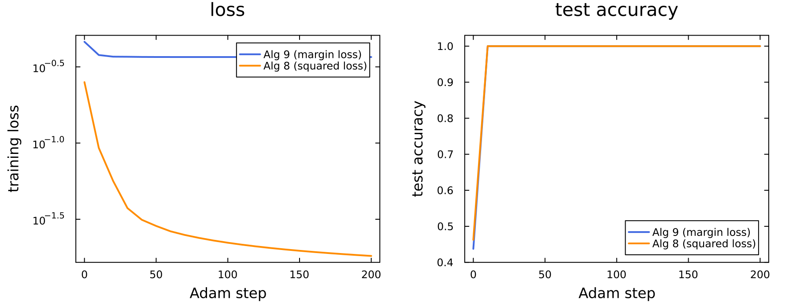
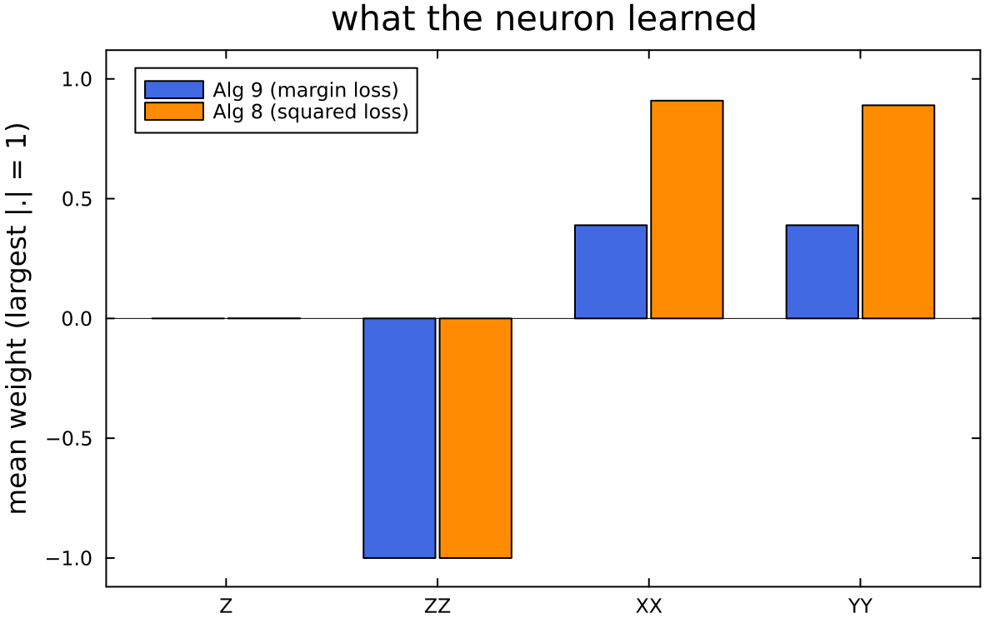
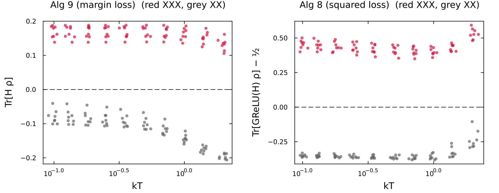
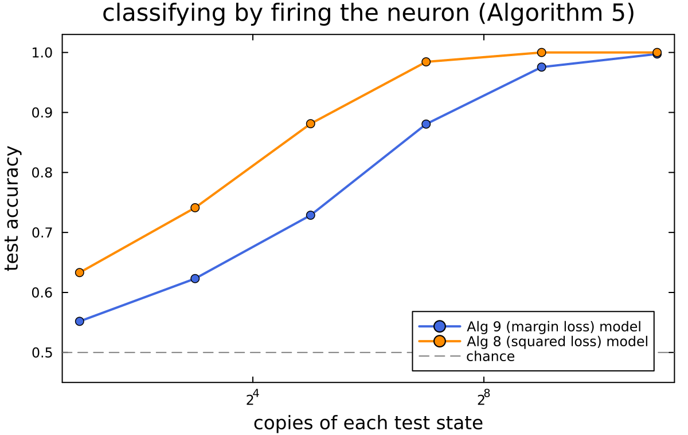

# A quantized GReLU neuron that tells XX chains from XXX chains — minimal version

*The bare-bones version of `../2_xx_xxx_grelu_study/REPORT.md`. The code is `data.jl`, `neuron.jl`, `run.jl` and `plots.jl`.*

## 1. The question

Can a single quantum neuron learn to tell which kind of spin chain produced a thermal state?

- **XX chain:** H = Σᵢ Jᵢ (XᵢXᵢ₊₁ + YᵢYᵢ₊₁), labelled XX (y = −1).
- **XXX chain:** H = Σᵢ Jᵢ (XᵢXᵢ₊₁ + YᵢYᵢ₊₁ + ZᵢZᵢ₊₁), labelled XXX (y = +1).

The couplings Jᵢ are random. The neuron receives the state ρ = e^{−H/kT}/Z itself, not measurements of it.

## 2. Data and split

- **Dataset:** 84 random 10-qubit chains (42 XX, 42 XXX), each at 10 temperatures from kT = 0.1 to 2, for 840 states.
- **States:** each state is rebuilt exactly from its couplings, and its energy is checked against the dataset file.
- **Split:** 16 whole chains (8 of each kind, all their temperatures) are held out as the test set, giving 160 test states. The remaining 68 chains (680 states) are for training.
- **Why split by chain:** the neuron is tested only on chains it has never seen.

## 3. The neuron

The neuron has a Hamiltonian built from trainable weights:

H(θ) = Σⱼ θⱼ Hⱼ,  with Hⱼ ∈ {Zᵢ, ZᵢZᵢ₊₁, XᵢXᵢ₊₁, YᵢYᵢ₊₁}  (37 weights).

Its output on a state ρ is **Tr[GReLU_T(H(θ)) ρ]**. GReLU_T is a smoothed ReLU (T = 1). This is the quantum analogue of ReLU(w·x), from He, Liu & Wilde, *Fermi–Dirac machines as quantizations of neurons*.

## 4. Training: Algorithm 9 or Algorithm 8

The paper gives two training algorithms. Each one is a quantum circuit whose measured outcomes average to the gradient of a loss:

| | Algorithm 9 | Algorithm 8 |
|---|---|---|
| loss | margin: mean Tr[GReLU(−yH) ρ] | squared: mean (Tr[GReLU(H) ρ] − t)², t ∈ {0, 1} |
| decision | sign of Tr[H ρ] | output > ½ |
| weights | 37 | 38 (adds a constant term) |

Either algorithm alone trains a neuron; we train one neuron with each. In this minimal version the gradient is computed **exactly**, which is the average the circuits converge to over many runs. Training uses Adam: 200 steps at learning rate 0.05, starting from small random weights. The weight decay is 10⁻³ (Alg 9) or 10⁻⁴ (Alg 8).

*Figure 1. Both losses fall smoothly. Test accuracy reaches 1.0 within about ten steps and stays there.*

## 5. Results

**Both neurons classify all 160 test states correctly:**

| model | test accuracy | ‖θ‖₁ |
|---|---|---|
| Algorithm 9 (margin loss) | 1.000 | 2.4 |
| Algorithm 8 (squared loss) | 1.000 | 33.0 |

The Algorithm 8 neuron needs much larger weights because it must push its output close to the targets 0 and 1.

*Figure 2. What the neurons learned. Both put negative weight on ZZ and positive weight on XX and YY, and almost none on single Z.*

The neurons learn to compare ⟨ZZ⟩ with ⟨XX⟩ + ⟨YY⟩:
- In an XXX chain the three correlators are equal, because the Hamiltonian is symmetric under rotations.
- In an XX chain, ⟨ZZ⟩ is much weaker than ⟨XX⟩.

So one linear combination of nearest-neighbour correlators separates the two classes. This is why the task is easy. Folder 2 confirms it with a small classical network, which also scores 100%, and a shuffled-label control, which scores 50%.

*Figure 3. The decision score of every test state, against temperature. The two classes separate at every temperature, with a clear gap at zero.*

## 6. Classifying with the neuron itself: firing (Algorithm 5)

Training produces the weights. To *use* the neuron, Algorithm 5 "fires" it:
1. Couple one copy of ρ to a continuous-variable mode (a qumode).
2. Measure the mode.
3. Output a random number whose average is Tr[GReLU(H) ρ].

With N copies we average N firings and apply each model's decision rule. The Alg 9 model needs Tr[H ρ], so it splits its copies between a neuron built from H and one built from −H.

*Figure 4. Test accuracy against the number of copies of each state, averaged over 10 repeats.*

| copies | 2 | 8 | 32 | 128 | 512 | 2048 |
|---|---|---|---|---|---|---|
| Alg 9 model | 0.55 | 0.62 | 0.73 | 0.88 | 0.98 | 1.00 |
| Alg 8 model | 0.63 | 0.74 | 0.88 | 0.98 | 1.00 | 1.00 |

The Alg 8 model reaches the same accuracy with roughly four times fewer copies. Its large weights spread the outputs of the two classes far apart.

## 7. Conclusions

1. A single quantized GReLU neuron with 37 weights classifies XX vs XXX thermal states perfectly. This holds at every temperature and on unseen chains.
2. Algorithms 8 and 9 are two alternative ways to train it, and either one is enough:
   - **Algorithm 9:** small weights, and cheaper and more stable to train.
   - **Algorithm 8:** large weights, but cheaper to fire afterwards (≈ 100–200 copies per state for ≈ 98%, against ≈ 500 for Algorithm 9).
3. The task is easy because the symmetry of XXX chains makes ⟨ZZ⟩ = ⟨XX⟩. A harder dataset, such as XXZ chains near Δ = 1, would be the next test.

## 8. What the full study (folder 2) adds

- Shot-by-shot simulation of the Algorithm 8/9 circuits. Training from single-shot gradients fails because the noise outweighs the signal.
- Gradient-noise and readout-cost measurements.
- Cross-validation of the settings.
- Transfer between temperatures, and a Z/ZZ-only ansatz.
- A literal ITensor simulation of the qumode in Algorithm 5.
- The classical feed-forward control.
- The full metrics table.
