# Quantized GReLU neuron on XX vs XXX thermal states

*Runs of 23–25 September 2026. All numbers below come from the CSVs in `results/`, and every figure is in `figures/` (PNG and PDF).*

## Summary

We trained the Gaussian-smoothed ReLU (GReLU) quantized neuron of He, Liu & Wilde (*Fermi–Dirac machines as quantizations of neurons*, Sec. IV.B and App. F) to tell apart thermal states of two random 10-site spin chains, XX and XXX. Training used GReLU versions of the paper's **Algorithm 9** (margin loss) and **Algorithm 8** (squared loss).

- **With exact gradients (the infinite-shot limit), both algorithms classify the 16 held-out chains perfectly.** Accuracy and AUC are 1.000, with 0 of 160 test states misclassified, at every temperature from kT = 0.1 to 2.
- **This is not a bug. The task is easy.** Because the XXX Hamiltonian is SU(2)-symmetric, its thermal states satisfy ⟨ZZ⟩ = ⟨XX⟩ = ⟨YY⟩ on every bond, and XX states do not. Two checks confirm it:
    - a 391-parameter ReLU feed-forward network on the same inputs also gets 1.000;
    - the same network drops to chance (0.497 ± 0.121 over 50 shuffles) when the training labels are shuffled, so the split does not leak.
- **The neuron learns that symmetry-breaking direction.** θ_XX = θ_YY on every bond, θ_ZZ has the opposite sign, and θ_Z ≈ 0.
- **It transfers across temperature, but so does a classical network.** Trained on hot rungs and tested on cold ones, and vice versa, the neuron scores 0.96–1.00. The feed-forward network scores 1.000 both ways on all 5 seeds, so transfer is not a quantum advantage here (section K).
- **The XX/YY terms matter, but only at the hottest temperature.** The same neuron restricted to Z and ZZ terms (a classical Ising neuron) is perfect up to kT = 1.41. At kT = 2 it fails on XXX chains (0.50 for Algorithm 9 with a bias term, 0.69 for Algorithm 8), because ⟨ZZ⟩ alone no longer separates the classes there. Overall it scores 0.950 and 0.969, against 1.000 for the full ansatz.
- **Using the trained neuron: firing it is the efficient route.** The paper's neuron-realisation algorithm (Gaussian Algorithm 5), which fires the neuron once per copy of ρ, classifies the test set at 99.8% with 256 copies per state for the Algorithm 8 model, and at 99.8% with 2,048 copies for the Algorithm 9 model (which needs two neurons, on H and −H). Estimating the same outputs with qubit Hadamard-test circuits instead is slower. It needs about 4,096 measurements for 99% with the Algorithm 9 model, and with the Algorithm 8 model it is still at chance at 4,096 (an estimated 3.6 million needed). So the Algorithm 8 model's apparent inference cost came from the qubit circuit's variance, not from the model.
- **Training on single-shot gradients failed at the budgets tried** (16–256 circuit runs per step). At the starting θ, Algorithm 9 needs about 1,200 runs per gradient (extrapolated from N ≤ 512) before the noise drops below the gradient itself. Algorithm 8 is about 10× noisier still, and its trained ‖θ‖₁ is about 14× larger. With an optimiser tuned for exact gradients, the noise inflates ‖θ‖₁, which raises the noise further, and training runs away. The estimators themselves are verified unbiased. This is an optimisation and budget problem, and it is the main open item.

---

## 1. Data

`data/xx_xxx_thermal_states/` is an external handoff. Its own `HANDOFF.md` and `CLAUDE.md` document it; the checksums verified after transfer.

```
H_XX  = Σ_i J_i (X_i X_{i+1} + Y_i Y_{i+1})                  label 0  (y = −1)
H_XXX = Σ_i J_i (X_i X_{i+1} + Y_i Y_{i+1} + Z_i Z_{i+1})    label 1  (y = +1)
```

- **Chains:** n = 10 sites, open boundary, no field, Pauli convention.
- **Couplings:** J_i ~ U[0.5, 1.5], i.i.d., drawn from the same distribution for both classes, so the couplings carry no label.
- **Size:** 84 chains (42 XX + 42 XXX) × 10 temperatures (kT = 2.0 … 0.1) = 840 states, balanced. Draw IDs 7–12 are missing, symmetrically in both classes: a generator shard crashed.
- **Format:** each state is shipped as an MPO at χ = 8, 16, 32 and 64, plus the chain's J and a dense-ED certificate.
- **Baseline supplied with the dataset** (`classify_n10.json`): logistic regression on the bond singular values already reaches AUC 1.000.

## 2. Train/test split

`results/split.csv`, made with seed 20260923 by `XXXData.make_split`.

- **Unit of splitting:** one chain (`model:draw`) with all 10 of its temperatures. A per-state split would put, say, kT = 0.5 of a chain in training and kT = 0.35 of the same chain in test, which measures interpolation in temperature rather than generalisation to new couplings. Draw IDs are per class ("XX:3" and "XXX:3" are different chains), so the group key includes the model.
- **Test:** 8 XX + 8 XXX chains = 160 states.
- **Train:** 34 + 34 chains = 680 states, divided into 5 folds with equal classes (7 + 7 chains each, the last 6 + 6) for choosing hyperparameters. The test set is never used for any choice.

## 3. Model and design choices

### 3.1 The neuron

H(θ) = Σ_j θ_j H_j uses the same 37 Pauli terms as the repo's `Alg9Yao`: Z_i, Z_iZ_{i+1}, X_iX_{i+1} and Y_iY_{i+1}. The neuron's output on a state ρ is Tr[GReLU_T(H(θ)) ρ], where

```
GReLU_T(x) = x Φ(x/T) + T φ(x/T)          (paper Eq. 92),    d/dx GReLU_T = Φ(x/T)   (Eq. 96)
```

### 3.2 Two training objectives

| | Algorithm 9 route | Algorithm 8 route |
|---|---|---|
| loss | L₉ = (1/M) Σ_m Tr[GReLU_T(−y_m H) ρ_m] | L₈ = (1/M) Σ_m (Tr[GReLU_T(H) ρ_m] − ỹ_m)², ỹ ∈ {0, 1} |
| origin | The logistic loss is softplus(−yH); replacing softplus with GReLU gives the Gaussian version of the paper's Eq. 56 | Paper Eq. 44 with GReLU instead of tanh |
| gradient | Theorem 17 (Eq. F84): the Algorithm 9 circuit (Fig. 11) with evolution time vt, t ~ N(0, 1/T²), v ~ U[0,1], and prefactor √(2/π)‖θ‖₁/T | 2·b1·b2 from two independent blocks on copies of ρ_m (App. B structure). b1 estimates the value via Lemma 5 integrated along λH; b2 is Theorem 17 |
| prediction | sign Tr[H ρ], because L_m(+1) − L_m(−1) = −Tr[H ρ_m] | output > ½ |
| bias (identity) term | **none** | **yes** |

**Why the targets and bias differ.**

- **Algorithm 8:** GReLU is never negative, so ±1 targets can't be reached. That route regresses onto {0, 1} and needs an offset.
- **Algorithm 9:** it has no bias, following the paper's convention (Sec. VI.D). It doesn't need one. The contrast between ZZ and XX/YY is independent of scale, so it keeps working as all correlators shrink at high temperature. A bias would instead push every hot state towards the same label.

**Other choices:**

- **Hyperparameters:** T and the L2 strength were chosen by 5-fold grouped cross-validation. For Algorithm 9, T only rescales θ (L(θ; T) = T·L(θ/T; 1)), so only the L2 strength was scanned, at T = 1.
- **Optimiser:** Adam, learning rate 0.05, 200 full-batch steps (150 in cross-validation), θ₀ = 0.1·N(0, 1) with a fixed seed. Every run starts from the same θ₀.

### 3.3 Input states: exact ρ, not the MPO

Each state is rebuilt exactly from its stored couplings by exact diagonalisation. The energies and log Z match the file to about 1e-13. The neuron takes ρ itself, so gauge invariance comes for free: the dataset's `tensors_gauge` control is irrelevant here.

The χ64 MPOs are **not** faithful enough to use as inputs:

| kT | MPO vs exact ρ, trace distance (median / max) | smallest MPO eigenvalue |
|---|---|---|
| 0.1 | 3.4e-3 / 1.6e-2 | −2.9e-3 |
| 2.0 | 1.3e-6 / 6.8e-5 | +1.7e-8 |

(`results/mpo_check.csv`, measured at each chain's coldest and hottest temperature.)

### 3.4 How the algorithms are simulated

The inputs are mixed states of 10 qubits. Simulating Algorithms 8 and 9 as statevectors (the repo's Yao backend) would need a 21-qubit purification for every circuit. Instead, each circuit is evaluated **exactly in the eigenbasis of H(θ)**, which is diagonalised once per optimiser step. Every time evolution then becomes a diagonal phase, and the Hadamard-test expectation ⟨Z_anc ⊗ H_k⟩ = Re Tr[H_k U ρ] becomes a trace. A single shot is a ±1 sample drawn from that expectation, which is the exact outcome distribution of one run of the circuit.

Four facts keep this cheap, and none of them is an approximation:

1. **Parity blocks.** Every model term is real and commutes with the global parity ∏Z_i, so all operators split into two real 512 × 512 blocks.
2. **Shared eigenvectors.** H_XX and H_XXX conserve total S^z. Each chain is therefore stored as its eigenvectors per S^z sector, and all 10 temperatures share them.
3. **Algorithm 9 needs only class averages.** The circuit is linear in its input, so drawing a random training state m and running the circuit gives the same outcome statistics as running it on the class-averaged state.
4. **Algorithm 8's value block can be pre-averaged.** Its output scale depends only on λ, so averaging the ±1 outcome over the sampled Pauli pair (j, k) first leaves an exactly Bernoulli outcome whose mean is diagonal in H's eigenbasis. The literal circuit version is kept as `literal=true` and tested against it.

The **exact gradient** (Daleckii–Krein divided differences) is the expected value of both estimators. It is used for the main runs and as the reference in the gradient-error experiments.

**The neuron firing (Gaussian Algorithm 5)** is simulated the same way. The algorithm couples a Gaussian qumode of width T₁ to ρ through e^{i x̂ ⊗ H/T₂}, measures its momentum p, and outputs T₂·ReLU(p). The coupling shifts p by an eigenvalue of H/T₂. So one firing is exactly: draw an eigenvalue E of H(θ) with Born probability ⟨E|ρ|E⟩, draw Z ~ N(0, 1), and output ReLU(E + T·Z), with T = T₁T₂. Its mean is Tr[GReLU_T(H)ρ] (Eq. 93). The two classification rules become:
- **Algorithm 8 model:** fire N times and predict XXX when the average is above ½.
- **Algorithm 9 model:** fire N times on each of two neurons, one on H(θ) and one on −H(θ), and predict XXX when mean(H) − mean(−H) ≥ 0. That difference estimates Tr[Hρ], because GReLU(x) − GReLU(−x) = x.

**The qumode itself, simulated explicitly in ITensor** (`src/qumode_itensor.jl`). The sampler above eliminates the qumode analytically. To check that reduction, Algorithm 5 was also simulated literally, with the control qumode as an explicit bosonic mode, on the n = 4 fixture (4 qubits + 1 qumode). The steps follow the algorithm [1, Sec. IV.B]:

1. **Sites.** The qumode is one ITensor site of type `"Boson"`, `siteind("Boson"; dim = d)`. In ITensor this is an alias of `"Qudit"`: a d-level truncated Fock space with the ladder operators `"a"`, `"adag"` and number operator `"N"` [2, 3]. The data register is `siteinds("Qubit", 4)`.
2. **Hamiltonian.** H(θ) is built term by term with `OpSum` (`"Z"`, `"X"`, `"Y"` Pauli operators, plus `"Id"` for the bias), converted with `MPO(os, sites)`, and contracted to a single operator ITensor with `prod` [3]. Its expectation in ρ reproduces the pipeline's Tr[Hρ] to 12 digits.
3. **Initial state.** The qumode starts in the pure Gaussian state whose momentum density is N(0, T₁²). Its Fock coefficients are computed numerically from that momentum wavefunction, using the same ⟨p|n⟩ = (−i)ⁿ ψₙ(p) (Hermite functions ψₙ) as the measurement, so no separate squeezing-sign convention enters [5]. T₁ = 1/√2 is the vacuum. The data register is ρ, written as an ITensor with row indices s′ and column indices s.
4. **Coupling.** x̂ = (a + a†)/√2 is built from the site operators, the generator x̂ ⊗ H(θ) as an outer product of ITensors, and U = exp(i x̂ ⊗ H/T₂) with ITensor's matrix exponential `exp(A::ITensor; ...)` over primed/unprimed index pairs [4, `matrix_algebra.jl`].
5. **Evolution.** The joint state |c⟩⟨c| ⊗ ρ evolves as U(·)U† with `apply(U, ρ; apply_dag = true)` [4, `product(A, B; apply_dag)` in `tensor_algebra.jl`].
6. **Homodyne measurement.** Tracing out the qubits (`delta(s′, s)` contractions) leaves the qumode's d × d density matrix ρ_q. The momentum distribution is P(p) = ⟨p|ρ_q|p⟩ on a fine grid, and the neuron's output is T₂·ReLU(p).

The simulated output distribution is compared with the analytic sampler's (section I2). The comparison covers every fixture state, both trained models (and the −H neuron of the Algorithm 9 model), Fock cutoffs d = 20–80, and two squeezings at the same T = T₁T₂.

### 3.5 Validation (`src/test_grelu_neuron.jl`, n = 4 fixture, 19 checks, all pass)

- **Reader:** contracting the MPOs reproduces the file's own stored trace distances to about 1e-15. This fixes site order, J order and the Pauli convention.
- **Algebra:** the Pauli signed-permutation algebra matches explicit Kronecker products.
- **Gradients:** the exact gradients of both losses match finite differences to about 1e-10.
- **Estimators:** the Algorithm 9 and Algorithm 8 Monte-Carlo estimators are unbiased (batch means within ±4.5 SE of the exact gradient) in every mode: exact circuit expectations, single shots, class averages vs individual states, pre-averaged vs literal value circuit.
- **Readout:** the finite-shot estimate of the neuron's output is unbiased.
- **Firing:** the mean of Gaussian Algorithm 5 firings equals the exact output Tr[GReLU(H)ρ], and fire(H) − fire(−H) recovers the Algorithm 9 score Tr[Hρ].
- **Qumode (separate script, `src/qumode_itensor.jl`):** the explicit ITensor simulation of Algorithm 5 reproduces the sampler's full output distribution (section I2).

## 4. Runs

| run | command argument | what it does | wall time (M1 Pro) |
|---|---|---|---|
| split | `split` | split, MPO check, correlator dump | ~40 s |
| cross-validation | `cv` | Alg 9: 4 L2 values × 5 folds; Alg 8: 3 T × 3 L2 × 5 folds; exact gradients, 150 steps | ~45 min |
| final | `final` | both losses on all 68 training chains, 200 exact steps, evaluated on test | ~2 min |
| temperature transfer | `kT` | train hot (kT ≥ 0.5) → test cold, and the reverse; both losses | ~4 min |
| gradient error | `gradvar` | error of both estimators vs N = 8…512 runs, 20 repeats, at θ₀ and at the trained θ, single shots and exact circuit expectations | ~30 min |
| finite shots | `shots` | training on single-shot Monte-Carlo gradients: Alg 9 N = 16/64/256, Alg 8 N = 64/256 runs per step | ~45 min |
| classical ansatz | `classical` | the same neuron with only Z and ZZ terms: Alg 9 with and without a bias term, Alg 8 with its bias; 200 exact steps | ~2 min |
| readout | `readout` | the trained neurons' test accuracy when each state's score comes from 1 … 4,096 measurements, 10 repeats | ~5 min |
| qumode check | `qumode_itensor.jl` | Algorithm 5 with an explicit ITensor qumode on the n = 4 fixture: 24 states × both models × 5 (Fock cutoff, squeezing) settings | ~1.5 min |
| firing | `fire` | the trained neurons used by firing them (Gaussian Algorithm 5): 1 … 16,384 firings per neuron, 10 repeats | ~2 min |
| classical control | `ffnn_xx_xxx.jl` | ReLU network: 5 seeds + 50 label shuffles; temperature transfer (5 seeds); finite-measurement inputs (3 … 12,288 copies, 5 networks × 10 repeats) | ~3 min |

**Cross-validation couldn't separate the settings.** Every setting of both losses reached mean validation AUC 1.000, so the choice fell to validation loss: Algorithm 9 T = 1, L2 = 1e-3; Algorithm 8 T = 1, L2 = 1e-4. Algorithm 9's validation *accuracy* was 0.989 rather than 1.000. The ranking was perfect, but one fold's threshold misplaced a few states.

## 5. Results

### A2. Why the classes separate

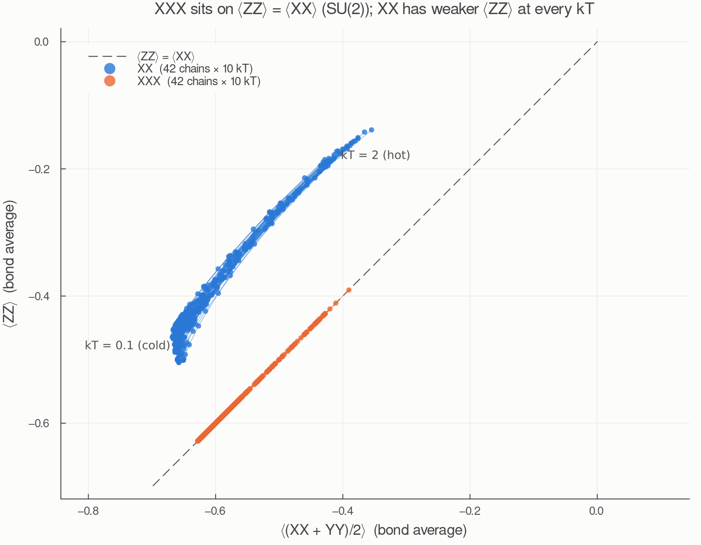

XXX states lie exactly on ⟨ZZ⟩ = ⟨XX⟩ at every temperature, because SU(2) symmetry forces it. XX states form a separate band with weaker ⟨ZZ⟩. For example, the bond averages ⟨ZZ⟩ vs ⟨XX⟩ are −0.18 vs −0.41 at kT = 2, and −0.46 vs −0.66 at kT = 0.1. ⟨Z_i⟩ = 0 for every state by symmetry.

⟨ZZ⟩ alone does *not* separate the classes across temperatures: hot XXX (≈ −0.45) overlaps cold XX (≈ −0.46). The information is in how ⟨ZZ⟩ compares with ⟨XX⟩.

### B1. Training with exact gradients

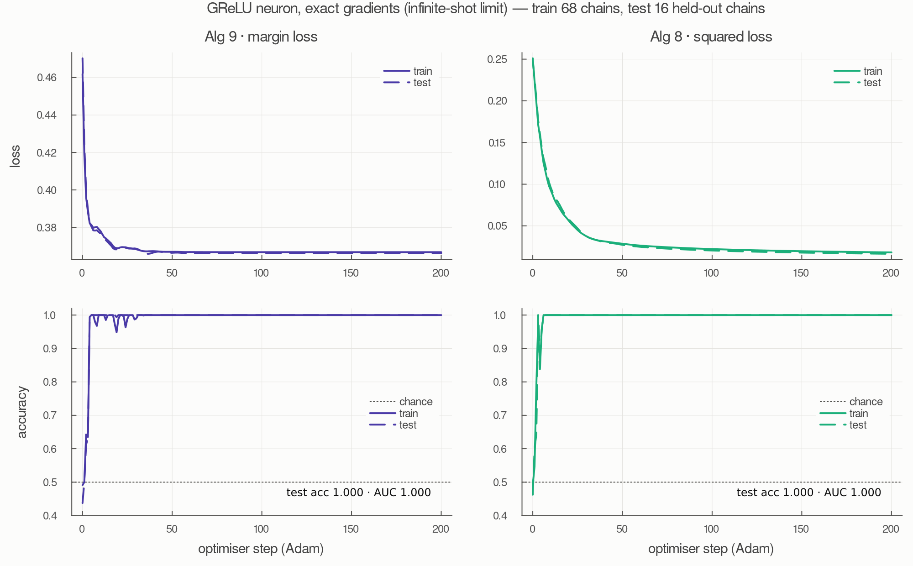

Both losses reach 100% test accuracy within 3–4 steps and stay there. Train and test losses overlap throughout, so there is no overfitting.

| | Algorithm 9 | Algorithm 8 |
|---|---|---|
| test accuracy / AUC | 1.000 / 1.000 | 1.000 / 1.000 |
| first step at 100% test accuracy | 4 | 3 |
| time per step | 0.12 s | 0.40 s |
| final ‖θ‖₁ | 2.4 | 33.0 |

### C. Test scores by class and temperature

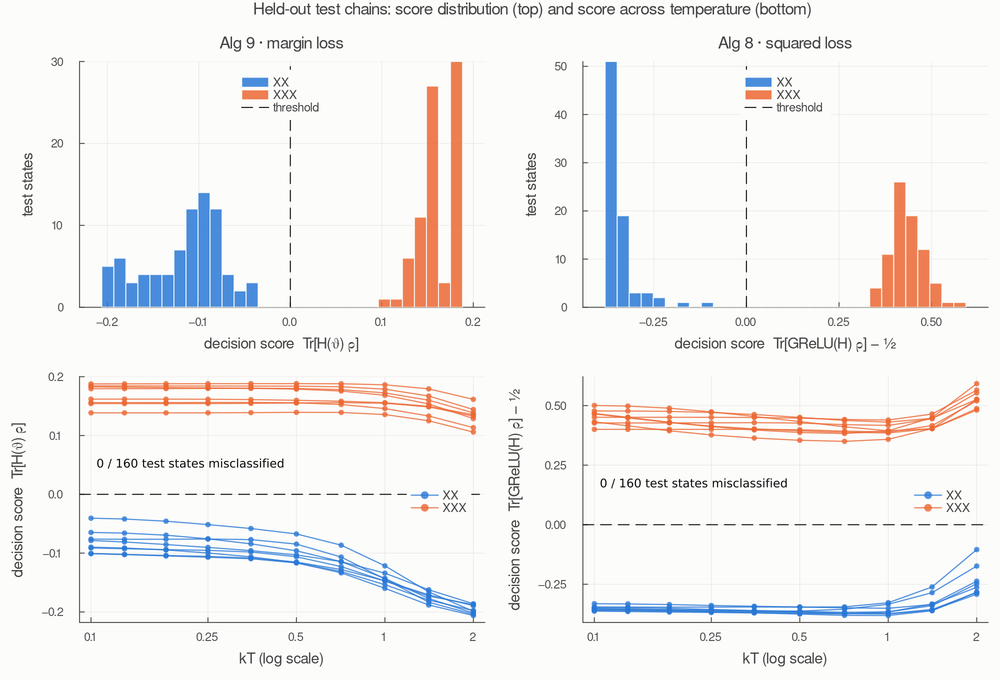

No test state is misclassified, and the gap around the threshold never closes. **For Algorithm 9 the margin is smallest in the *cold* states:** the gap between the lowest XXX score and the highest XX score is 0.18 at kT = 0.1 and 0.29 at kT = 2. The XX scores drift towards the threshold as the chain cools. For Algorithm 8 the gap is 0.73 at kT = 0.1 and 0.59 at kT = 2.

### D1. What the neuron learned

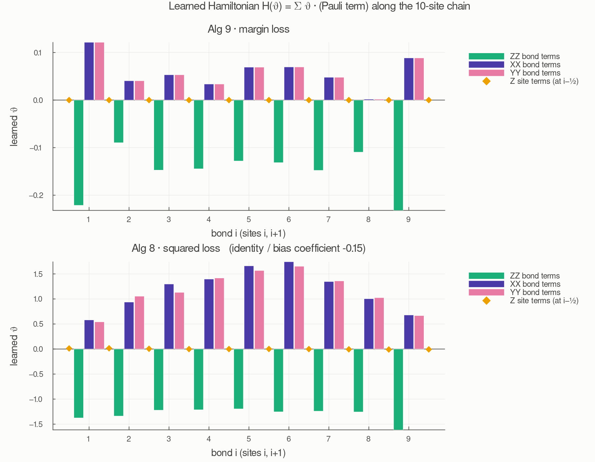

Both losses learn the same structure:

- θ_XX,i ≈ θ_YY,i on every bond, which reflects the U(1) symmetry of both classes;
- θ_ZZ,i has the opposite sign;
- θ_Z,i ≈ 0 (at most 0.015), since those inputs carry nothing.

For Algorithm 9, the score on an XXX state is ⟨ZZ⟩·(θ_ZZ + 2θ_XX). That score is exactly zero along θ_ZZ = −2θ_XX, which is the SU(2)-invariant direction. The learned ratio −Σθ_ZZ / Σθ_XX = 2.6 tilts away from that null direction just enough to give XXX states a positive score, while the weaker ⟨ZZ⟩ of XX states makes theirs negative.

Algorithm 8 (ratio 1.1, bias −0.15) reaches its decision through the nonlinearity instead, and needs a θ about 14× larger.

### E. What it costs: gradient noise and finite-shot training

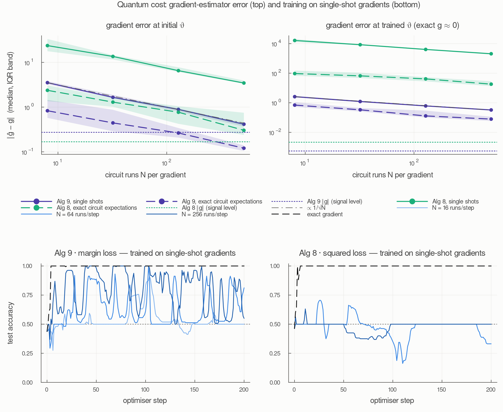

**Top row: gradient-estimator error ‖ĝ − g‖ against the number of circuit runs N.** It is plotted as absolute error, because at the trained θ the exact gradient is essentially zero and relative error is meaningless. The dotted lines mark ‖g‖ itself: below them an estimate carries signal.

- **Both estimators fall as 1/√N**, as unbiased Monte-Carlo estimators should.
- **At the starting θ, Algorithm 9 with single shots is still above ‖g‖ at N = 512** (error 1.5 × ‖g‖). Extrapolating along 1/√N, it crosses near N ≈ 1,200. With exact circuit expectations (no shot noise) it crosses near N ≈ 130.
- **Algorithm 8 is about an order of magnitude noisier at equal N.** It multiplies two estimators, and its prefactors grow as ‖θ‖₁³/T².
- **At the trained θ, Algorithm 8's noise is enormous** (about 10⁴ at N = 8), because its ‖θ‖₁ has grown to 33.

**Bottom row: test accuracy when every step's gradient comes from single-shot circuit runs.**

| run | final test accuracy | best | steps with test accuracy ≥ 0.95 | final ‖θ‖₁ | median cos(ĝ, g) |
|---|---|---|---|---|---|
| Alg 9, N = 16 | 0.50 | 0.91 | 0% | 26.4 | 0.06 |
| Alg 9, N = 64 | 0.81 | 0.99 | 0% | 16.8 | 0.14 |
| Alg 9, N = 256 | 0.55 | 1.00 | 26% | 6.7 | 0.23 |
| Alg 8, N = 64 | 0.33 | 0.71 | 0% | 38.9 | 0.01 |
| Alg 8, N = 256 | 0.50 | 0.63 | 0% | 42.9 | −0.01 |

Adam normalises each coordinate, so gradient steps driven by noise still have full size. They inflate ‖θ‖₁, and the estimator's prefactor (∝ ‖θ‖₁/T) then makes the next gradient noisier. With exact gradients, Algorithm 9 finishes at ‖θ‖₁ = 2.4; with N = 16 it ends at 26. Algorithm 9 with N = 256 is the only run that often reaches 100%, but it doesn't hold there.

### F1. Temperature transfer

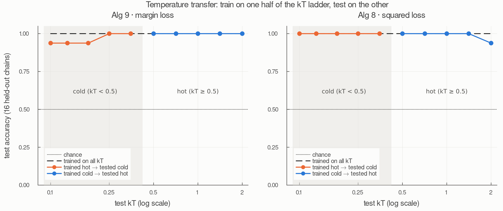

| | trained hot → tested cold | trained cold → tested hot |
|---|---|---|
| Algorithm 9 | 0.963: one chain (XX:21) wrong at kT = 0.1, 0.13, 0.18 | 1.000 |
| Algorithm 8 | 1.000 | 0.988: one chain (XX:41) wrong at kT = 2 |

The learned direction is almost temperature-independent, because the symmetry signature holds at every kT. The only errors are at the extremes of the ladder, and for Algorithm 9 they are exactly where section C showed the margin is narrowest. The classical feed-forward network transfers perfectly on the same split (section K), so good transfer reflects the data rather than anything specific to the quantum neuron.

### G. Does the quantum part matter? The classical-ansatz neuron

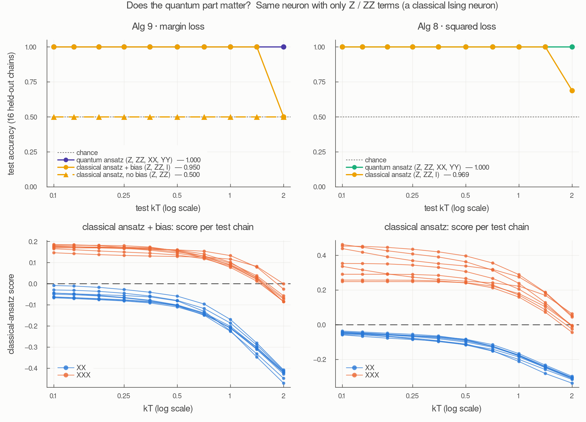

This uses the same GReLU neuron and training, but H(θ) keeps only the Z_i and Z_iZ_{i+1} terms. That makes it a classical Ising neuron in the paper's sense: every term commutes, so it only ever sees the Z-basis probability distribution of ρ.

| | overall test accuracy | kT ≤ 1.41 | kT = 2 | test AUC |
|---|---|---|---|---|
| Alg 9, quantum ansatz (37 terms) | 1.000 | 1.000 | 1.000 | 1.000 |
| Alg 9, classical ansatz + bias (20 terms) | 0.950 | 1.000 | 0.500 (all 8 XXX chains wrong) | 0.968 |
| Alg 9, classical ansatz, no bias (19 terms) | 0.500 | 0.500 | 0.500 | 0.994 |
| Alg 8, quantum ansatz (38 terms) | 1.000 | 1.000 | 1.000 | 1.000 |
| Alg 8, classical ansatz (20 terms, includes bias) | 0.969 | 1.000 | 0.688 (5 of 8 XXX chains wrong) | 0.999 |

- **The no-bias row is a threshold artefact, not missing information.** Algorithm 9 has no bias by design. That works for the full ansatz because the XX and YY terms let scores take either sign. Without them, the score Σ θ_ZZ⟨ZZ⟩ has the same sign for every state, since every state has ⟨ZZ⟩ < 0. It ranks the test states almost perfectly (AUC 0.994) but can never cross the threshold. The fair classical comparison is therefore the row with a bias.
- **With the bias, the classical neuron fails only at kT = 2, and only on XXX chains.** The bottom panels show why. As the chain heats up, the XXX scores fall towards the XX scores and cross the threshold at kT = 2. This is exactly the overlap in A2: hot XXX ⟨ZZ⟩ ≈ −0.45 against cold XX ≈ −0.46. With ⟨ZZ⟩ as its only information, a single threshold can't handle every temperature at once. The full ansatz compares ⟨ZZ⟩ with ⟨XX⟩ and has no such problem.
- **The classical Algorithm 8 neuron found a subtler signal.** It learned alternating site terms (θ_Z,i ≈ ±0.4 along the chain) even though ⟨Z_i⟩ = 0 for every state. Its Hamiltonian is diagonal, so Tr[GReLU(H)ρ] = Σ_z p(z)·GReLU(E(z)) weighs the whole Z-basis distribution p(z) nonlinearly, not just its averages. It is picking up an alternating (Néel-like) pattern in which configurations are likely. That is why it does better at kT = 2 than the linear Algorithm 9 score.

**Which states the classical-ansatz neuron gets wrong.** One marker per test state: x is temperature, and each row is one of the 16 test chains (8 XX, 8 XXX). **Hollow means correctly classified, filled means misclassified.** These are exact outputs, so the errors reflect what the Z-only *model* can represent, not measurement noise.

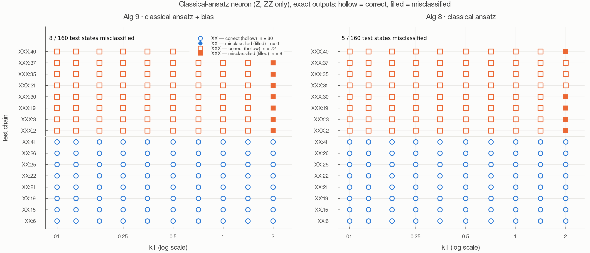

- **Every error is in one column:** XXX states at kT = 2. No XX state is misclassified.
- **Algorithm 9 with a bias** misses all 8 XXX chains there. A single threshold on ⟨ZZ⟩ can't separate hot XXX from the XX states it must also call negative (A2).
- **Algorithm 8** keeps 3 of the 8 (XXX:31, :35, :37). Its learned Z_i terms let it read a little more of the Z-basis distribution than the linear Algorithm 9 score (section G).
- **The same plot for the full quantum ansatz is entirely hollow** (the exact-limit column of J), so it isn't shown separately.

### H. Inference cost: measurements per classification

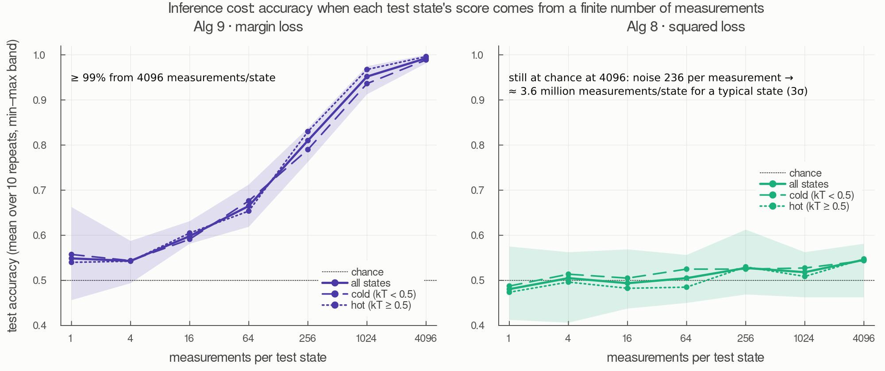

This takes the trained neurons (exact gradients) and asks how many measurements each test state needs before its score reliably has the right sign. For Algorithm 9 the score Tr[Hρ] is estimated by measuring a randomly chosen Pauli term, weighted by |θ_k|; each measurement gives ±‖θ‖₁. For Algorithm 8 the output Tr[GReLU(H)ρ] comes from the value circuit.

| measurements per state | 1 | 16 | 64 | 256 | 1,024 | 4,096 |
|---|---|---|---|---|---|---|
| Alg 9 test accuracy | 0.55 | 0.60 | 0.67 | 0.81 | 0.95 | 0.99 |
| Alg 8 test accuracy | 0.48 | 0.49 | 0.51 | 0.53 | 0.52 | 0.55 |

- **Algorithm 9:** the noise per measurement is 2.3 (≈ ‖θ‖₁ = 2.4). Reaching 3σ takes about 2,000 measurements for a typical test state and about 30,000 for the hardest one. Cold and hot states cost about the same.
- **Algorithm 8:** the noise per measurement is about 236, set by the value circuit's prefactor ‖θ‖₁²/(√(2π)T) with ‖θ‖₁ = 33. That's about 100× Algorithm 9's noise, against a margin only about 2.5× larger. A typical state would need about 3.6 million measurements, and the hardest about 46 million.

Both of these estimate the neuron's output with qubit Hadamard-test circuits. Firing the neuron directly is much cheaper; see I below.

### I / J. Using the neuron: classifying by firing it (Gaussian Algorithm 5)

Algorithms 8 and 9 only *train* θ. To use a trained neuron on a new state, the paper realises it with Algorithm 5 (Gaussian version for GReLU, Sec. IV.B): one copy of ρ per firing, with a continuous-variable control register (section 3.4). **This is the procedure that actually classifies**, so the results in this section, not the exact-output figures, are the quantum neurons' classification results.

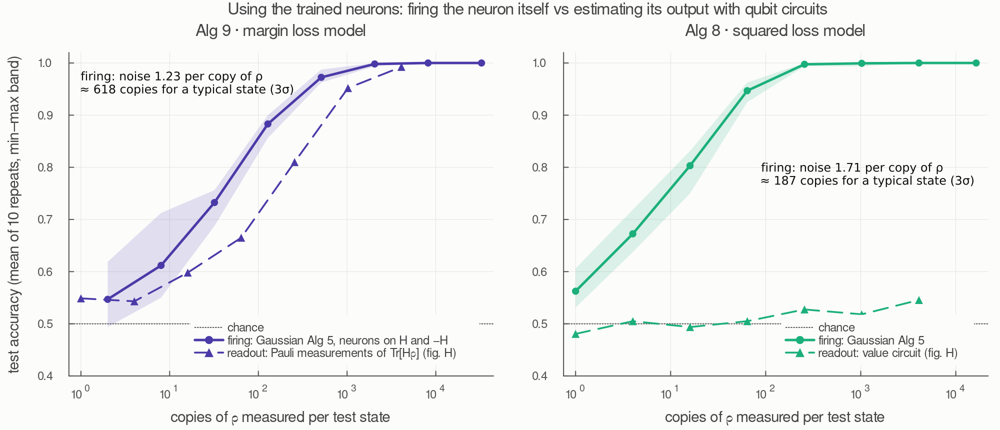

| firings per neuron | 1 | 4 | 16 | 64 | 256 | 1,024 | 4,096 |
|---|---|---|---|---|---|---|---|
| Alg 9 model (2 neurons → 2N copies of ρ) | 0.547 | 0.612 | 0.733 | 0.883 | 0.973 | 0.998 | 1.000 |
| Alg 8 model (N copies of ρ) | 0.562 | 0.672 | 0.803 | 0.947 | 0.998 | 0.999 | 1.000 |

(Test accuracy, mean of 10 repeats.)

- **Firing beats the qubit readouts for both models.** For the Algorithm 9 model, 512 copies give 0.97, against 0.81 with 256 Pauli measurements and 0.95 with 1,024. For the Algorithm 8 model the difference is dramatic: firing reaches 0.998 with 256 copies, while the value circuit is at chance at 4,096.
- **Why the Algorithm 8 model is cheap to fire.** A firing's noise is set by how spread out H(θ)'s eigenvalues are on ρ (plus the Gaussian width T), about 1.7 per copy. The value circuit's noise is set by its prefactor ‖θ‖₁²/(√(2π)T) ≈ 236. The model is the same; only the estimator changes.
- **Budget for 3σ on a typical test state:** about 190 copies for the Algorithm 8 model, and about 620 for the Algorithm 9 model, whose two neurons each add noise.

**Is the sampler faithful to the real algorithm? (I2)** The firings above use the analytic reduction of section 3.4. The explicit ITensor simulation of Algorithm 5, with the qumode as a truncated-Fock `"Boson"` site, gives the same output distribution:

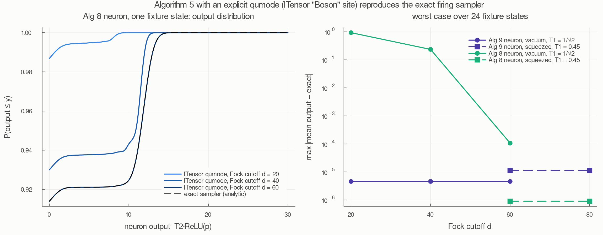

| model (n = 4 fixture) | Fock cutoff d | qumode | max \|mean − exact\| over 24 states | max \|ΔCDF\| | decisions identical to exact |
|---|---|---|---|---|---|
| Alg 9 (H and −H neurons) | 20, 40, 60 | vacuum (T₁ = 1/√2) | 4.6e-6 | 6.7e-6 | yes (24/24) |
| Alg 9 | 60, 80 | squeezed (T₁ = 0.45) | 1.1e-5 | 1.7e-5 | yes |
| Alg 8 | 20 | vacuum | 0.93 | 0.081 | **no** (accuracy 0.50 vs 1.00) |
| Alg 8 | 40 | vacuum | 0.24 | 0.026 | yes |
| Alg 8 | 60 | vacuum | 1.1e-4 | 5.5e-5 | yes |
| Alg 8 | 60, 80 | squeezed (T₁ = 0.45) | 8.7e-7 | 1.4e-6 | yes |

- **With a large enough Fock cutoff, the explicit qumode reproduces the sampler's whole output distribution,** not just its mean, to the numerical precision of the momentum grid (10⁻⁵–10⁻⁶).
- **The cutoff needed depends on the trained neuron.** The coupling displaces the qumode's momentum by E/T₂, so a Hamiltonian with a wide spectrum pushes the qumode to high photon numbers. The fixture Algorithm 8 neuron (energies ⟨H⟩ ≈ −5.6 on these states) needs d ≥ 60. At d = 20 truncation distorts its output enough to destroy classification. The probability lost from the truncated space ("leak") stays at 10⁻¹⁵ even then, because the truncated coupling is still unitary, so convergence in d, not leak, is the check to use.
- **Only T = T₁T₂ matters.** A squeezed qumode (T₁ = 0.45, T₂ = 2.22) gives the same outputs as the vacuum (T₁ = 1/√2, T₂ = 1.41), as Eq. 94 says. It also converges faster for the Algorithm 8 neuron, because the larger T₂ means smaller momentum shifts.
- **The explicit simulation was run at n = 4.** At n = 10 the coupling U is a (1024·d) × (1024·d) matrix, about 60 GB at d = 60, so a dense explicit simulation doesn't fit. It would need an MPS/MPO treatment of the joint qubit–qumode state. The n = 10 results therefore use the analytic sampler, which this check validates.

**Which test states are misclassified when classifying by firing.** The scatter has the same encoding as G2 (x = kT, one row per test chain, hollow = correct, filled = misclassified). The columns are 4, 64 and 1,024 firings per neuron (repeat 1 of 10), and the exact limit, which is what firing converges to with unlimited copies.

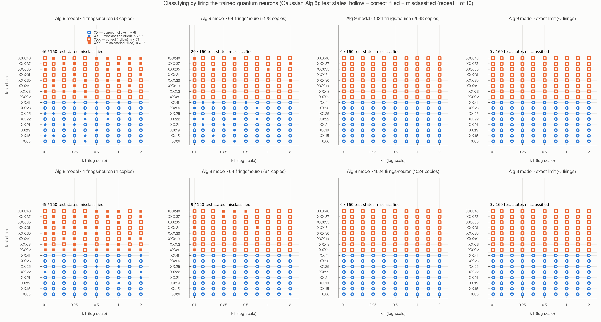

- **Errors don't pile up at one temperature,** unlike the classical ansatz (G2). Finite-firing noise hits every state in proportion to how close it sits to the threshold.
- **Algorithm 9 model:** errors lean cold, where its exact margin is smallest (section C). Over all 10 repeats, the cold (kT < 0.5) error rate is 15% vs 8% for hot states at 64 firings per neuron, and 4.8% vs 0.7% at 256.
- **Algorithm 8 model:** no temperature preference (4.8% cold vs 5.9% hot at 64).
- **By 1,024 firings per neuron** both models are at 0 of 160 on this repeat, the same as the exact limit.

### Classical control: a feed-forward network (`src/ffnn_xx_xxx.jl`)

A dense network with inputs x = the same 37 local expectation values (standardised on training data only) → 10 ReLU → 1 logit, 391 parameters. It was trained with Adam and cross-entropy for 1000 epochs, and its hand-written gradient matches finite differences to 3e-10.

| | test accuracy | test AUC |
|---|---|---|
| 5 random initialisations | 1.000 on every one | 1.000 on every one |
| 50 shuffles of the training chains' labels | 0.497 ± 0.121 (min 0.25, max 0.84) | 0.51 |

The shuffled-label control is what rules out leakage. Individual shuffles scatter around 0.5 because a random permutation still leaves about 50 ± 6% of chains correctly labelled. Test accuracy correlates (0.52) with how many labels a shuffle happened to leave correct.

### K. Quantum neuron vs the feed-forward network

The network is put through the same tests as the quantum neuron: the same hot/cold temperature transfer as F1, and classification from a finite number of copies of ρ. A classical network can't take ρ itself as input. Its 37 inputs (⟨Z_i⟩, ⟨Z_iZ_{i+1}⟩, ⟨X_iX_{i+1}⟩, ⟨Y_iY_{i+1}⟩) must be measured, and three measurement settings cover all of them:
- measuring every qubit in the **Z basis** gives every Z_i and Z_iZ_{i+1} at once;
- the **X basis** gives every X_iX_{i+1};
- the **Y basis** gives every Y_iY_{i+1}.

With S copies of ρ per state, S/3 go to each basis. Each copy yields one bitstring drawn from that basis's exact joint outcome distribution, which reproduces the exact inputs to 1.6e-15. As with the quantum neurons, the networks are trained on exact inputs and tested on estimated ones.

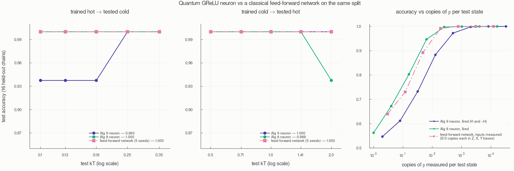

| | hot → cold | cold → hot | copies of ρ for 95% accuracy* | copies for 99% | hardware needed at test time |
|---|---|---|---|---|---|
| Alg 9 neuron (37 parameters), fired | 0.963 | 1.000 | ≈ 360 | ≈ 1,300 | qumode + qubits (Algorithm 5) |
| Alg 8 neuron (38 parameters), fired | 1.000 | 0.988 | ≈ 70 | ≈ 200 | qumode + qubits (Algorithm 5) |
| Feed-forward network (391 parameters), measured inputs | 1.000 (5 seeds) | 1.000 (5 seeds) | ≈ 110 | ≈ 190 | single-qubit measurements in 3 bases |

\*Interpolated on a log scale between the measured budgets (network: 0.892 at 48 copies, 0.992 at 192, 1.000 from 768).

- **Temperature transfer:** the network is perfect both ways, on every seed. The quantum neurons each miss one chain in one direction. Transfer is a property of this data, whose symmetry signature holds at every temperature, not an advantage of the quantum neuron.
- **Measurement cost:** at equal numbers of copies of ρ, the network is about as efficient as firing the Algorithm 8 neuron, and 3–7× more efficient than firing the Algorithm 9 neuron (3× at 95%, 7× at 99%). It needs only single-qubit measurements in three fixed bases, with no qumode or Hamiltonian evolution.
- **What the quantum neuron still has:** about 10× fewer trainable parameters (37 vs 391), and a directly interpretable θ (D1). It needs no hand-chosen inputs: the same neuron would apply to states where no small set of local expectation values is known to be enough. On this dataset, though, such a set exists, and the network uses it at least as well.

### L. Correct and incorrect counts by class

The practical classifiers (the quantum neurons fired with Gaussian Algorithm 5, and the network with measured inputs), each at roughly matched numbers of copies of ρ per test state. Bars are mean counts over repeats, out of 80 XX and 80 XXX test states. Hollow bars are correctly classified states; filled bars are misclassified ones.

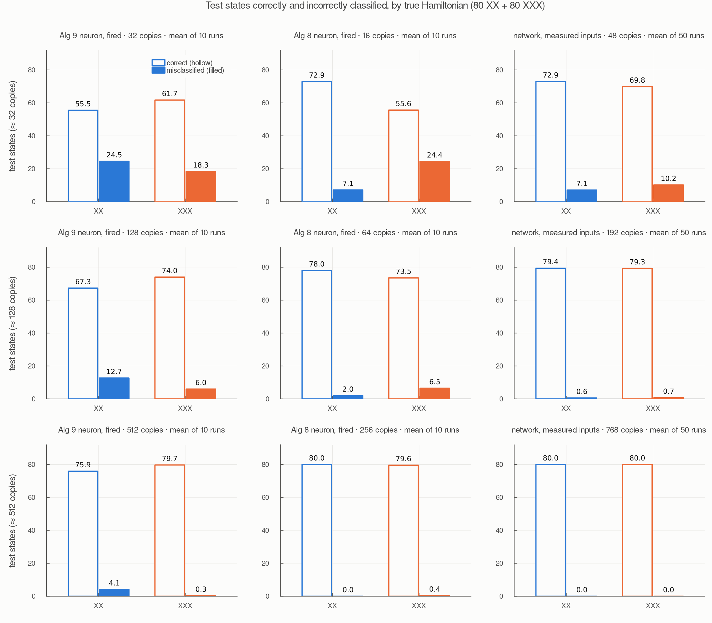

| ≈ copies of ρ | Alg 9 neuron: XX / XXX wrong | Alg 8 neuron: XX / XXX wrong | network: XX / XXX wrong |
|---|---|---|---|
| ≈ 32 (32 / 16 / 48) | 24.5 / 18.3 | 7.1 / 24.4 | 7.1 / 10.2 |
| ≈ 128 (128 / 64 / 192) | 12.7 / 6.0 | 2.0 / 6.5 | 0.6 / 0.7 |
| ≈ 512 (512 / 256 / 768) | 4.1 / 0.3 | 0.0 / 0.4 | 0.0 / 0.0 |

- **The Algorithm 8 neuron's errors are mostly XXX states called XX**, matching its precision-above-recall pattern in the metrics table.
- **The Algorithm 9 neuron's remaining errors at high budgets are XX states, mostly cold.** At ≈512 copies, 36 of its 41 XX errors (over 10 runs) are at kT < 0.5, where XX exact scores sit closest to the threshold (section C). The chain with the most errors, XX:21, is the same one it missed in the hot → cold transfer test (F1).
- **The network has the most even split**, and is nearly error-free from about 128 copies.

### Classification metrics

`src/metrics_xx_xxx.jl` → `results/classification_metrics.csv`. All metrics are computed on the 160 test states, with XXX as the positive class. Accuracy, precision, recall, F1 and IoU use each model's own decision rule; mAP and AUC use only how the model ranks the states.

**The quantum neurons, classifying by firing** (Gaussian Algorithm 5, section I/J). These are the results of a procedure that could actually be run. Each value is the mean over 10 repeats:

| model, used by firing it | copies of ρ per state | accuracy | precision | recall | F1 | IoU (XXX) | mIoU | mAP | AUC |
|---|---|---|---|---|---|---|---|---|---|
| Alg 9 model, 16 firings/neuron | 32 | 0.733 | 0.716 | 0.771 | 0.742 | 0.590 | 0.578 | 0.814 | 0.815 |
| Alg 9 model, 64 firings/neuron | 128 | 0.883 | 0.854 | 0.925 | 0.888 | 0.798 | 0.791 | 0.956 | 0.954 |
| Alg 9 model, 256 firings/neuron | 512 | 0.973 | 0.951 | 0.996 | 0.973 | 0.948 | 0.947 | 0.999 | 0.999 |
| Alg 9 model, 1024 firings/neuron | 2048 | 0.998 | 0.996 | 1.000 | 0.998 | 0.996 | 0.996 | 1.000 | 1.000 |
| Alg 8 model, 16 firings/neuron | 16 | 0.803 | 0.887 | 0.695 | 0.779 | 0.639 | 0.669 | 0.892 | 0.893 |
| Alg 8 model, 64 firings/neuron | 64 | 0.947 | 0.974 | 0.919 | 0.945 | 0.897 | 0.899 | 0.991 | 0.991 |
| Alg 8 model, 256 firings/neuron | 256 | 0.998 | 1.000 | 0.995 | 0.998 | 0.995 | 0.995 | 1.000 | 1.000 |
| Alg 8 model, 1024 firings/neuron | 1024 | 0.999 | 0.999 | 1.000 | 0.999 | 0.999 | 0.999 | 1.000 | 1.000 |

With few firings, the Algorithm 8 model errs towards calling XXX states XX (precision above recall), while the Algorithm 9 model errs slightly the other way. By 1,024 firings per neuron, both are within 0.004 of perfect on every metric.

**Exact outputs: the unlimited-firing limit, and the classical baselines.** For the quantum neurons these rows are the limit the firing rows converge to. For the feed-forward network they are its actual classification, because a classical network's output is exact. For the classical-ansatz neuron they show what the Z-only model can represent (section G).

| model | params | accuracy | precision | recall | F1 | IoU (XXX) | mIoU | mAP | AUC |
|---|---|---|---|---|---|---|---|---|---|
| GReLU neuron, Alg 9, exact limit (∞ firings) | 37 | 1.000 | 1.000 | 1.000 | 1.000 | 1.000 | 1.000 | 1.000 | 1.000 |
| GReLU neuron, Alg 8, exact limit (∞ firings) | 38 | 1.000 | 1.000 | 1.000 | 1.000 | 1.000 | 1.000 | 1.000 | 1.000 |
| Feed-forward ReLU network | 391 | 1.000 | 1.000 | 1.000 | 1.000 | 1.000 | 1.000 | 1.000 | 1.000 |
| Classical-ansatz neuron, Alg 9 + bias, exact | 20 | 0.950 | 1.000 | 0.900 | 0.947 | 0.900 | 0.905 | 0.969 | 0.968 |
| Classical-ansatz neuron, Alg 8, exact | 20 | 0.969 | 1.000 | 0.938 | 0.968 | 0.938 | 0.939 | 0.999 | 0.999 |

**Definitions.**

- IoU = TP / (TP + FP + FN): the overlap between the predicted and true XXX sets.
- mIoU is its average over both classes.
- mAP is the mean over both classes of the average precision (area under the precision–recall curve).

**Reading the tables.**

- **Network seeds:** the network row is seed 1. All 5 seeds scored 1.000 accuracy and AUC (section *Classical control*).
- **The exact-limit rows are saturated.** The quantum and network rows are all 1.000 because the task is easy (A2). They show the trained models are correct, but they can't rank them; the firing rows and the classical-ansatz rows are where the models differ.
- **The classical-ansatz rows show where errors come from.** Precision is 1.000 but recall is 0.90–0.94: every error is an XXX state at kT = 2 called XX (G2), and no XX state is ever called XXX.
- **Ranking vs threshold:** the classical Algorithm 8 neuron's mAP and AUC (0.999) are much higher than its accuracy. It ranks the states almost perfectly; the misses come from where the single threshold falls, not from the ranking.

## 6. Analysis

1. **The dataset does not test for a quantum advantage.** The Algorithm 9 neuron's decision, sign Tr[H(θ)ρ], is *linear* in the 37 local expectation values. At inference time it is a linear classifier on features that already separate the classes (A2). The GReLU nonlinearity and the non-commuting terms affect only how the loss shapes θ during training. The classical network matches it, with about 10× the parameters (391 vs 37). It also matches it on temperature transfer and on measurement cost at test time (K). The honest claims here are about **interpretability** (D1 recovers the SU(2) signature) and **parameter efficiency**, not about accuracy, transfer or measurement cost.
2. **What the XX/YY terms buy is access to observables, not quantum computation.** The classical-ansatz neuron fails at kT = 2 because it can only see the Z basis (G). The feed-forward network, which is also classical, succeeds because it is given ⟨XX⟩ and ⟨YY⟩ as inputs. So the difference is which measurements the model can use, not whether its computation is quantum. A test of the latter would need states where no small set of local expectation values separates the classes (Future directions 2).
3. **Algorithm 9 is the better route for training; for use, it depends on how the neuron is run.** Training: its trained ‖θ‖₁ is 14× smaller, and the cost of both gradient estimators grows with ‖θ‖₁/T (Eq. C42), with Algorithm 8's growing faster. Use: if the neuron's output is estimated with qubit circuits (H), the Algorithm 8 model is prohibitively expensive (~3.6 million measurements per state). If the neuron is fired directly with Gaussian Algorithm 5 (I), it is the *cheaper* model (~190 copies vs ~620). Algorithm 5 needs a continuous-variable control register, while Algorithms 8/9 and the qubit readouts need only qubits and Hadamard tests. The inference cost therefore depends on the hardware as well as on the model.
4. **Shot-based training needs different optimisation, not just more shots.** The failure mode is a feedback loop between ‖θ‖₁ and variance, which an optimiser designed for exact gradients doesn't damp. The gradient-error figure puts a floor on the budget: about 1,200 single-shot runs per gradient before the estimate beats the signal at θ₀.
5. **Cold states are the harder regime for the Algorithm 9 neuron**, the opposite of the naive expectation that hot, nearly maximally mixed states are hardest. Relative to its correlators, the symmetry signature is largest when hot (A2); as the chain cools, XX states' ⟨ZZ⟩ grows towards their ⟨XX⟩. For the classical ansatz it's the opposite: kT = 2 is its failure point (G). Which temperature is hard depends on which observables the model can use.

## 7. Caveats

- **One split.** One test chain is 10 states (6% of the test set), so the accuracy steps are coarse. The 100% results are robust (0 errors, with visible margins), but the temperature-transfer misses rest on a single chain each.
- **Cross-validation was uninformative.** Every setting tied at AUC 1.000.
- **The finite-shot runs used one seed each**, and the optimiser settings came from exact-gradient tuning.
- **The simulation is noiseless.** It draws exact shot statistics, but has no gate noise and no Trotter error. The e^{−iHt} evolutions are exact.
- **Only n = 10.** The eigenbasis method scales as 8ⁿ, which is fine to n ≈ 12.

## 8. Future directions

1. **Make shot-based training work.** Try a decaying learning rate (plain SGD / Robbins–Monro rather than Adam), an explicit ‖θ‖₁ cap or L1 penalty (which directly bounds the sample complexity), budgets that grow with ‖θ‖₁, and variance reduction (stratified sampling of s, t, v; importance sampling of k). Run several seeds.
2. **A harder task.** Remove the SU(2) giveaway, for example XXZ with anisotropy Δ = 0.9 vs 1.1, fields, or energy-matched pairs. Or change the target: regress kT, or classify phases. This needs the dataset generator, which is not in the handoff. G suggests a good target: states where the classes differ only in correlations that no small set of local measurements captures.
3. **Cheaper inference on qubit-only hardware.** Without a qumode, readout cost scales as (‖θ‖₁/margin)² (H). Training with an L1 penalty, or with a margin constraint at fixed ‖θ‖₁, would trade a little training loss for far fewer measurements per classification. With a qumode, firing (I) is already cheap. The explicit ITensor qumode (I2) is the starting point for testing how robust that advantage is: add photon loss, finite squeezing at fixed T₂, and a finite-resolution homodyne measurement.
4. **Scale in n** with the MPS backend (`tensor-network-testing/algorithm9.jl`) for n > 12, and check whether the learned θ structure persists.
5. **Hardware realism.** Add depolarising noise to the Hadamard tests and Trotterise the evolutions, then redo figure E.
6. **Compare with the dataset's tensor-feature baselines on equal footing**: the same split, with parameter counts on one axis.

## Appendix: reproducing everything

Run from the repository root. The data must be at `data/xx_xxx_thermal_states/`.

The whole pipeline is also a Julia notebook, [`pipeline.ipynb`](pipeline.ipynb) (kernel "Julia 1.12" via IJulia). It runs the fast steps in the notebook and the experiments below as subprocesses. Set `RERUN = true` to regenerate `results/` from scratch.

```bash
# 19 checks, ~20 s
julia experiments/xx_xxx_grelu/src/test_grelu_neuron.jl
# split + MPO check + correlators
julia experiments/xx_xxx_grelu/src/train_xx_xxx_grelu.jl split
# the experiments (cv first)
julia experiments/xx_xxx_grelu/src/train_xx_xxx_grelu.jl cv final kT gradvar shots classical readout fire
# classical control
julia experiments/xx_xxx_grelu/src/ffnn_xx_xxx.jl        # main, transfer, measure
# Algorithm 5 with an explicit ITensor qumode (needs fixture_n4.h5 and cv_choice.csv)
julia experiments/xx_xxx_grelu/src/qumode_itensor.jl
# test-set metrics table
julia experiments/xx_xxx_grelu/src/metrics_xx_xxx.jl
# all figures from results/
julia experiments/xx_xxx_grelu/src/plot_xx_xxx_grelu.jl
# this PDF
python3 experiments/xx_xxx_grelu/src/build_report_pdf.py
```

`cv` must run before the others: they read `results/cv_choice.csv`. The runs of 23 September predate the `gnorm` column in `gradvar.csv`. For those runs, `results/gradvar_gnorm.csv` holds the exact gradient norms at the same two θ values, and the plot script uses whichever is present.

Dependencies (global Julia 1.12 environment): HDF5, Optimisers, Plots, SpecialFunctions, and for the qumode check ITensors (v0.9.30) and ITensorMPS (v0.4.1).

## References

1. A. He, N. Liu, M. M. Wilde, *Fermi–Dirac machines as quantizations of neurons*, arXiv:2605.24386 (2026). The local copy is `Papers/Fermi-Dirac Machines.pdf`. Algorithm 5 and Theorem 7 (Sec. III.A); Gaussian activations and GReLU, Eqs. 92–96 (Sec. IV.B); Theorem 17 (App. F.4); Algorithms 8 and 9 (Apps. B, C.2).
2. ITensorMPS.jl documentation, *Included SiteTypes*: "Boson" and "Qudit" site types (dimension `dim`, operators `a`, `adag`, `N`). https://docs.itensor.org/ITensorMPS/stable/IncludedSiteTypes.html — the same page ships as `docs/src/IncludedSiteTypes.md` in ITensorMPS v0.4.1.
3. ITensors.jl v0.9.30 source: site-type definitions `src/lib/SiteTypes/src/sitetypes/boson.jl` (Boson = alias of Qudit) and `qudit.jl` (Fock-space operators); `OpSum`/`MPO` from ITensorMPS.jl v0.4.1.
4. ITensors.jl v0.9.30 source: `exp(A::ITensor, Linds, Rinds; ishermitian)` in `src/tensor_operations/matrix_algebra.jl` (matrix exponential over index pairs); `product(A::ITensor, B::ITensor; apply_dag)` in `src/tensor_operations/tensor_algebra.jl` (used by `apply`, gives U ρ U†).
5. C. Weedbrook et al., *Gaussian quantum information*, Rev. Mod. Phys. 84, 621 (2012). Quadrature operators x̂ = (a + a†)/√2, p̂ = i(a† − a)/√2, Gaussian states, and homodyne detection.
6. M. Fishman, S. R. White, E. M. Stoudenmire, *The ITensor Software Library for Tensor Network Calculations*, SciPost Phys. Codebases 4 (2022).
